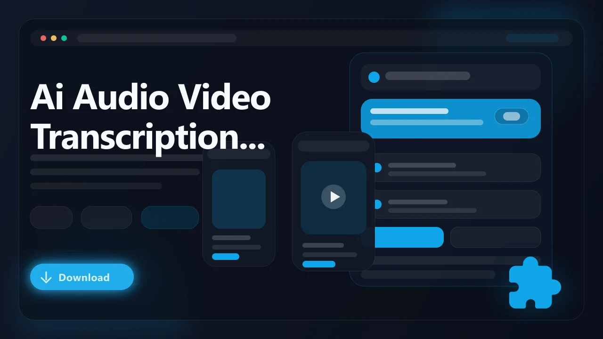

# AI Audio Video Transcription Generator — Coming Soon (Browser Extension)

> Turn any audio or video playing in your browser into a text transcript using speech-to-text AI. **This extension is currently in development and has not been released yet.**

AI Audio Video Transcription Generator is an upcoming browser extension that will let users produce accurate text transcriptions from any media playing in a browser tab without external software or manual typing. It is being built to work directly within the browser playback environment, converting spoken content into readable text, subtitles, and captions in real time.

- Generate transcripts from any audio or video playing in the browser
- Produce subtitles and closed captions from live or on-demand media
- Export transcription output as standard text and subtitle file formats
- Handle speech-to-text processing without leaving the browser tab
- Designed for Chrome, Edge, Brave, Opera, Firefox, and other Chromium browsers

## Status

**This extension is not yet available for download.** Development is in progress and a release date has not been announced. Sign up below to get notified when it launches.

:bell: **Get notified when this launches:** [Join the waitlist](https://serp.ly/ai-audio-video-transcription-generator)

## Links

- :hourglass_flowing_sand: Waitlist: [Coming Soon — Sign Up](https://serp.ly/ai-audio-video-transcription-generator)
- :question: Help center: [SERP Help](https://help.serp.co/en/)
- :bulb: Request features: [GitHub Issues](https://github.com/serpapps/ai-audio-video-transcription-generator/issues)

## Preview

## Table of Contents

- [Why AI Audio Video Transcription Generator](#why-ai-audio-video-transcription-generator)
- [Planned Features](#planned-features)
- [How It Will Work](#how-it-will-work)
- [Expected Formats](#expected-formats)
- [Who It's For](#who-its-for)
- [Use Cases We're Building For](#use-cases-were-building-for)
- [FAQ](#faq)
- [License](#license)
- [Notes](#notes)
- [About AI Transcription](#about-ai-transcription)

## Why AI Audio Video Transcription Generator

Most audio and video content on the web lacks accurate transcripts. Auto-generated captions on platforms like YouTube are often incomplete or riddled with errors, and many podcasts, webinars, and live streams offer no text version at all. Manually transcribing spoken content is tedious and time-consuming, while standalone transcription services require uploading files to third-party servers and switching between multiple tools.

AI Audio Video Transcription Generator is being designed to solve this by running speech-to-text AI directly from the browser. The goal is to capture the audio output of any active tab, process spoken words through an AI model, and deliver a clean, formatted transcript that you can copy, edit, or export as a subtitle file. No file uploads, no external applications, and no context switching away from the content you are watching or listening to.

## Planned Features

- Real-time speech-to-text transcription from any browser tab audio
- Support for pre-recorded video, live streams, podcasts, and embedded audio players
- Speaker diarization to identify and label different voices in a conversation
- Timestamp alignment so transcript segments map to exact playback positions
- Multiple output formats including plain text, SRT subtitles, and VTT captions
- Language detection and multi-language transcription support
- Editable transcript panel within the extension popup for quick corrections
- Cross-browser compatibility targeting Chrome, Edge, Brave, and Firefox

## How It Will Work

1. Install the extension once it is released.
2. Navigate to any webpage with audio or video content you want to transcribe.
3. Start playback of the media in the browser tab.
4. Click the extension icon to begin capturing audio from the active tab.
5. Watch the transcript appear in the extension panel as speech is processed.
6. Review and edit the generated text directly within the extension interface.
7. Choose your preferred export format such as TXT, SRT, or VTT.
8. Save the finished transcript file to your local machine.

## Expected Formats

- Input: Any audio or video stream playing through a browser tab (HTML5 media, embedded players, live streams)
- Output: TXT (plain text transcript), SRT (SubRip subtitle), VTT (WebVTT subtitle/caption)

Exported files will be saved in standard formats compatible with most video editors, media players, subtitle tools, and accessibility platforms.

## Who It's For

- Content creators who need transcripts for repurposing video into blog posts or articles
- Students and researchers transcribing lectures, interviews, and conference talks
- Journalists converting recorded interviews and press briefings into written text
- Accessibility advocates generating captions for uncaptioned web media
- Professionals who attend webinars and want searchable text notes from recordings

## Use Cases We're Building For

- Transcribe a YouTube video that has no captions or has inaccurate auto-generated subtitles
- Generate SRT files from podcast episodes for publishing on a website with synchronized text
- Capture meeting notes from a recorded video call playing back in the browser
- Produce VTT caption files for your own video content before uploading to a hosting platform
- Create searchable text archives of lecture recordings or online course material

## FAQ

**When will AI Audio Video Transcription Generator be released?**
A release date has not been set. Sign up at the waitlist link above to be notified as soon as it is available.

**Does it require uploading files to a server?**
No. The extension is designed to process audio directly from the browser tab. The transcription workflow does not require you to upload media files to an external service.

**What languages will it support?**
Multi-language support is planned. The initial release will focus on English, with additional languages added based on the underlying AI model capabilities and user demand.

**How accurate will the transcriptions be?**
Accuracy will depend on audio clarity, background noise levels, and speaker accents. The AI model is expected to handle clear speech at high accuracy, with an in-extension editor available for manual corrections.

**Is it free?**
Pricing details will be announced closer to launch. SERP extensions typically include a free trial period.

**Will it work with any website?**
The extension is being built to capture audio output from any browser tab, so it should work with most websites and media players that deliver audio through the browser.

## License

This repository is distributed under the proprietary SERP Apps license in the [LICENSE](LICENSE) file. Review that file before copying, modifying, or redistributing any part of this project.

## Notes

- This extension is in development and is not available for download yet
- Only transcribe content you own or have explicit permission to convert to text
- Transcription accuracy will vary based on audio quality and clarity of speech
- Website or platform changes may affect audio capture functionality once released
- An active internet connection may be required depending on the AI model used

## About AI Transcription

AI-powered transcription uses speech-to-text models to convert spoken language into written text. Modern models can handle multiple speakers, varied accents, and noisy audio with increasing reliability. Despite improvements in platform-level auto-captions, many audio and video sources on the web still lack any form of accurate transcript. AI Audio Video Transcription Generator is being built to give users a browser-native tool that closes that gap, turning any audible content in a tab into portable, editable text without relying on external applications or cloud upload workflows.
